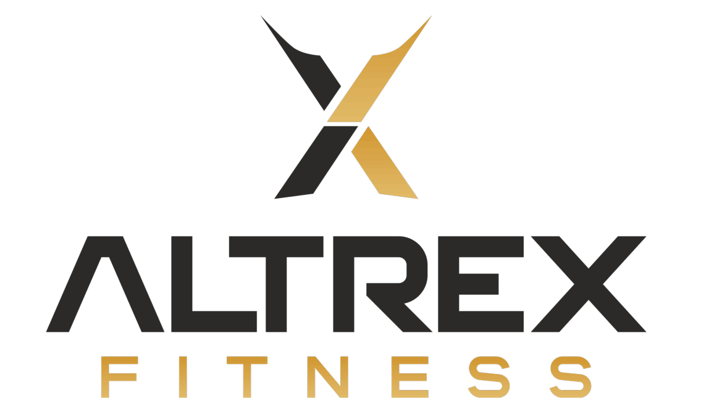

<div align="center">
  
  <h1>Altrex GMS</h1>
  <p><strong>Manage your gym with absolute precision.</strong></p>
  <p>The complete, AI-assisted operating system built exclusively for Altrex Fitness.</p>
</div>

---

## 🚀 Overview

**Altrex GMS (Gym Management System)** is a modern, full-stack application designed to completely automate and streamline operations for Altrex Fitness. From automated WhatsApp reminders to real-time face recognition check-ins, Altrex GMS eliminates manual front-desk work.

## ✨ Core Features

*   👥 **Member Management**: Complete profiles, body metrics (height/weight), and active plan tracking.
*   💳 **Automated Payments**: Integrated with Razorpay for seamless membership renewals and due-amount calculations.
*   📱 **WhatsApp Automation**: Automated birthday wishes, renewal reminders, payment receipts, and inactivity alerts.
*   🏋️ **Personal Training (PT)**: Dedicated modules for assigning and tracking PT packages and sessions.
*   📸 **Smart Attendance**: Real-time check-ins featuring a live face-recognition feed.
*   🛡️ **Role-Based Access**: Secure dashboards separated for **Gym Owners** (full analytics) and **Front Desk Staff** (daily operations).
*   📊 **Analytics & Reports**: Visual revenue tracking, upcoming expirations, and active member stats.

## 🛠️ Tech Stack

Built with modern web technologies for maximum performance, security, and scalability:

*   **Frontend:** [Next.js](https://nextjs.org/) (App Router), React, Tailwind CSS, Lucide Icons
*   **Backend:** Next.js Server Actions & API Routes
*   **Database & Auth:** [Supabase](https://supabase.com/) (PostgreSQL, Row Level Security, Storage)
*   **Payments:** Razorpay API
*   **Notifications:** Meta WhatsApp Business API
*   **Error Tracking:** [Sentry](https://sentry.io/)
*   **Deployment:** Netlify / Vercel

## 📦 Getting Started

### Prerequisites

Ensure you have Node.js (v18+) installed.

### Installation

1. **Clone the repository**
   ```bash
   git clone https://github.com/your-username/altrex-gms.git
   cd altrex-gms
   ```

2. **Install dependencies**
   ```bash
   npm install
   ```

3. **Set up Environment Variables**
   Create a `.env.local` file in the root directory and add the necessary keys (Supabase, Razorpay, WhatsApp, Sentry, etc.).

4. **Run the Development Server**
   ```bash
   npm run dev
   ```
   Open [http://localhost:3000](http://localhost:3000) to view the application.

## 🛡️ Architecture & Security

*   **Database Security:** Powered by Supabase Row Level Security (RLS) policies to ensure data isolation.
*   **Automated Backups:** Scheduled daily GitHub Actions (`db-backup.yml`) utilizing `pg_dump` to securely export and archive the PostgreSQL database.
*   **Strict Type Checking:** Enforced by TypeScript and Zod validation schemas.

## 🤝 Contributing

This is a proprietary system built for Altrex Fitness. All commits must pass strict ESLint formatting and TypeScript compilation checks via Husky pre-commit hooks before being pushed to production.

---
<div align="center">
  <i>Built for the future of fitness management.</i>
</div>
